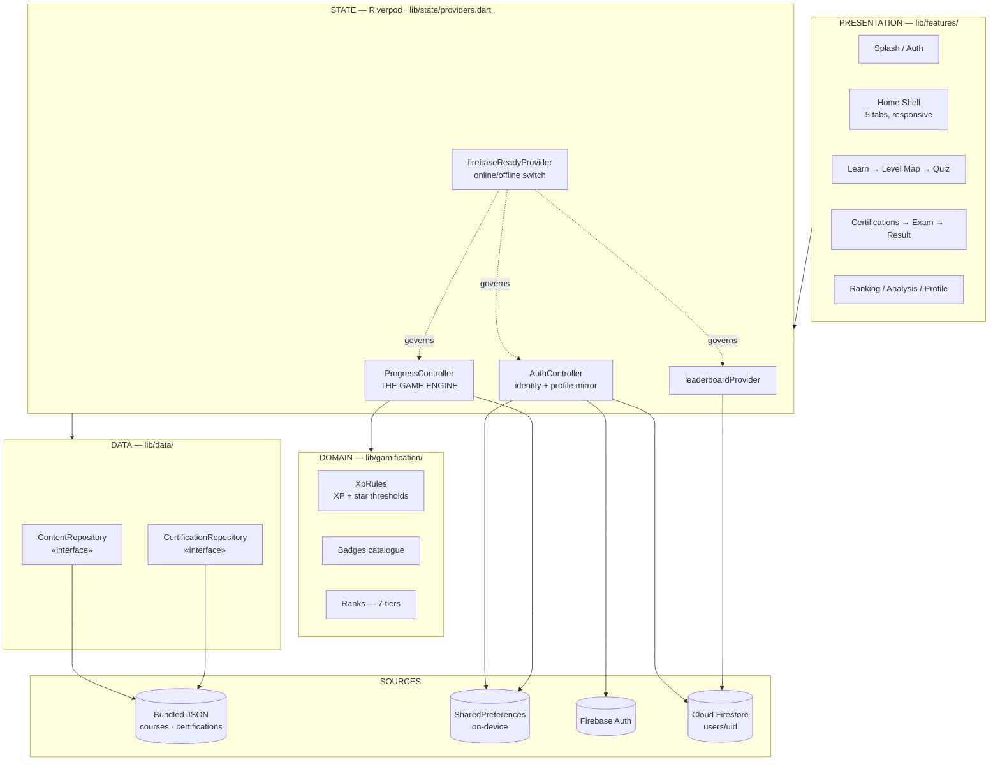
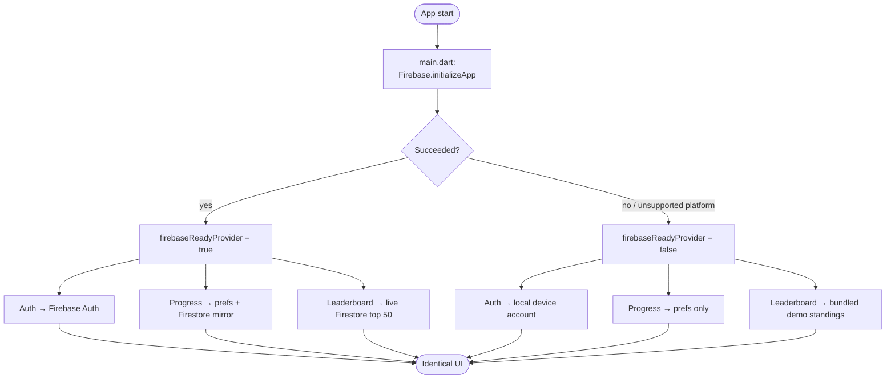
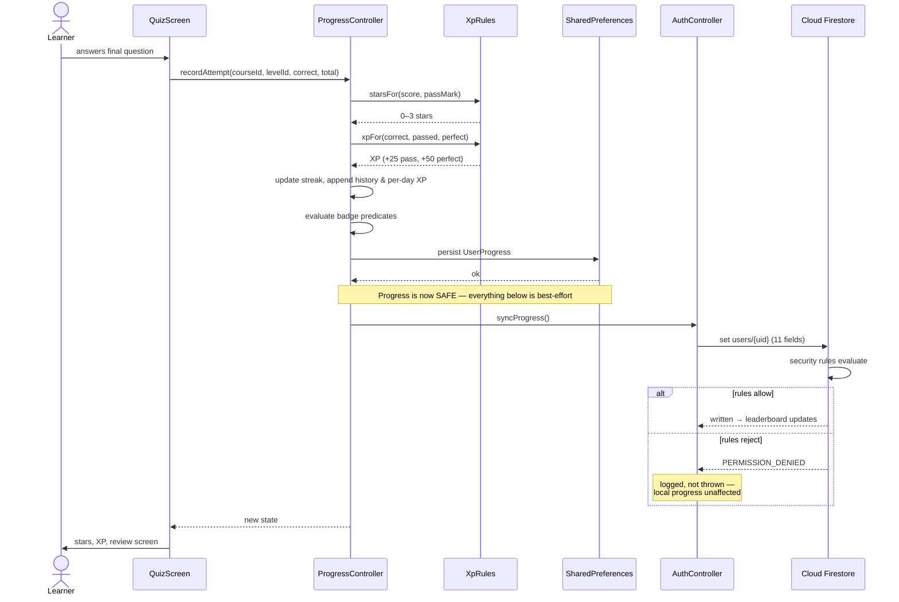
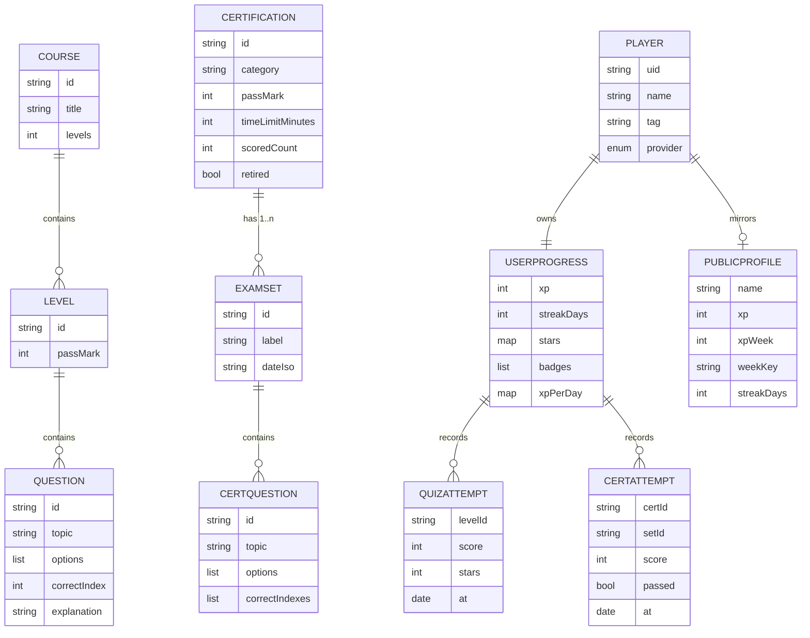
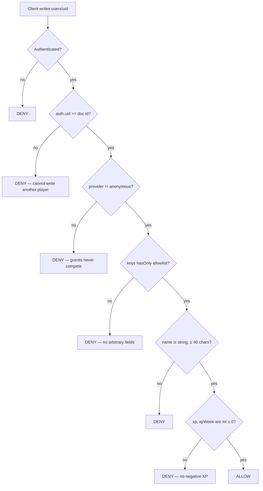

# Solution Design

**Project:** Anthropic Arena · **Version:** 0.5.0 · **Date:** 2 September 2026

---

## 1. Design principle

> **Local-first, with Firebase layered behind swappable interfaces.**

Every significant decision in this codebase follows from that one sentence.

The application is **fully functional offline**. Accounts, progress, XP, streaks
and stars all persist on-device. Firebase is **additive** — it contributes the
leaderboard, cross-device identity and cloud sync — but its absence degrades
the app rather than breaking it.

**Why:** a demo or a training session cannot depend on conference wifi. A
learner on a commute should not lose their streak. And a backend outage should
never make the product unusable.

## 2. System architecture



### Layer responsibilities

| Layer | Owns | Never does |
|---|---|---|
| **Presentation** | Widgets, navigation, layout | Business rules, storage |
| **State** | Orchestration, persistence, sync | Rendering |
| **Domain** | Scoring, badges, ranks — pure functions | I/O |
| **Data** | Loading content behind interfaces | Knowing about widgets |

Every screen is a `ConsumerWidget` reading providers. No widget touches
`SharedPreferences` or Firestore directly.

## 3. The online/offline switch

The entire online/offline decision reduces to **one boolean**, set once at
startup:



**The UI is identical in both modes.** No screen knows which path it is on.
iOS, which is not yet registered with Firebase, takes the right-hand path
automatically with no code branch of its own.

## 4. Core flow — completing a level

The most important sequence in the app. This is the "end-to-end" path:
frontend → state → domain → local storage → backend → database.



**Design note.** Local persistence happens *before* the network call, and the
network call cannot fail the operation. The learner never loses progress
because of a backend problem.

**Lesson learned.** The original implementation discarded that error entirely
(`.catchError((_) {})`). A rules/payload mismatch therefore failed silently for
17 days — the leaderboard froze while the UI looked perfectly healthy. It was
found by querying Firestore directly and comparing field sets against the
client payload. The rules were corrected and the swallow replaced with a log.
**Fail loudly in the log, quietly in the UI.**

## 5. Data model



### Storage split

| Where | What | Why |
|---|---|---|
| **Bundled JSON** | All questions | Works offline, ships with the app, validated by tests |
| **SharedPreferences** | Full progress, attempt history | Source of truth; survives offline |
| **Firestore `users/{uid}`** | 11-field public profile only | Only what the leaderboard needs |

**Deliberate:** answer history never leaves the device. The cloud holds a small
public projection, not the learner's full record. Less to secure, less to leak.

## 6. Security model



### Controls in place

| Control | Implementation |
|---|---|
| Ownership | `request.auth.uid == uid` — you may only write your own profile |
| Guest exclusion | Anonymous providers cannot write at all |
| Field allowlist | `hasOnly([...])` — 11 permitted keys, nothing else |
| Type + range checks | `xp`/`xpWeek` must be non-negative integers |
| Length cap | Display name ≤ 40 characters |
| Content immutability | `courses` collection is `allow write: if false` |
| Private history | Attempt data never leaves the device |
| Credential hygiene | Signing keystore and `key.properties` are git-ignored |
| Exam-bank gating | Certifications require a non-guest account |

**Firebase client keys are not secrets.** They ship in every client by design;
security is enforced by the rules above, not by hiding configuration.

**Tenant restriction.** `AuthConfig.microsoftTenant` controls which Microsoft /
Entra ID accounts may sign in, so the deployment can be limited to the
organisation.

## 7. Scalability

### Reads scale to zero cost

All 689 questions ship inside the app bundle. **Content reads generate no
backend traffic at all** — question load is O(1) in users. Adding 10,000
learners adds nothing to the content bill.

### The backend footprint is deliberately tiny

Per learner, the cloud holds **one document of eleven fields**. Writes occur
only on level completion, not per question.

### Known ceiling, and the fix

| Constraint | Today | Scale path |
|---|---|---|
| Leaderboard | Top 50, client-sorted | Firestore composite index + pagination |
| Weekly board | `xpWeek` + `weekKey` reset per ISO week | Already designed; needs a scheduled reset function |
| Content updates | Requires an app release | `FirestoreContentRepository` — the interface already exists |
| Attempt history | Capped on-device (200 quiz / 100 exam) | Sub-collection `users/{uid}/attempts` — rules already written |

**The seams are pre-built.** Each row above is an implementation swap behind an
existing interface, not a redesign. That is the payoff of the repository
pattern.

### Content scaling

New credentials are **data, not code**:

```
edit assets/content/certifications.json  →  flutter test  →  release
```

Two authoring pipelines already automate this — `import_questions.py`
(CSV/Excel → JSON) and `convert_mcq_bank.js` (XLSX → JSON). Adding a
credential requires no engineering.

## 8. Key technical decisions

| Decision | Chosen | Rejected | Why |
|---|---|---|---|
| Framework | **Flutter** | React Native, native ×2 | One codebase → web + Android + iOS; web enables a zero-install demo |
| State | **Riverpod** | setState, BLoC, Provider | Compile-safe, testable without widgets — the engine is unit-tested directly |
| Content | **Bundled JSON behind an interface** | Hardcoded Dart, direct Firestore | Offline-capable, swappable, test-validated |
| Persistence | **SharedPreferences** | SQLite, Hive | Progress is one small object; a database would be over-engineering |
| Backend | **Firebase** | Custom API | Auth + Firestore + Hosting with no server to operate |
| Auth | **Microsoft / Entra ID** | Email only | Colleagues sign in with existing work accounts |
| Balance | **One `XpRules` file** | Scattered constants | Tuning is one file, and unit-tested |
| Exam scoring | **All-or-nothing multi-select** | Partial credit | Matches how the real exam scores — realism is the product |

## 9. Quality gates

- **33 automated tests** across 8 files
- **Content validation in CI-style tests** — malformed questions fail the build
  rather than shipping (unique ids, option counts, in-range answers, sane pass
  marks)
- **`flutter_lints`** via `analysis_options.yaml`
- **Regression tests written from real bugs** — two overflow tests exist
  because those bugs happened once

See `03-TECHNICAL-DOCUMENTATION.md` for module-level detail and
`04-TESTING.md` for the test strategy.
